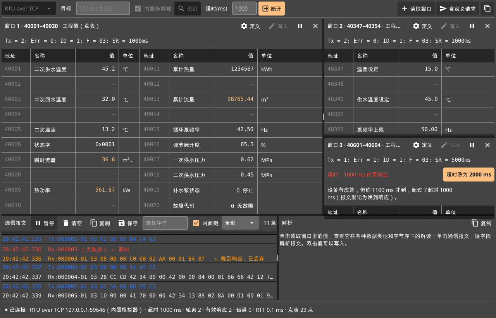
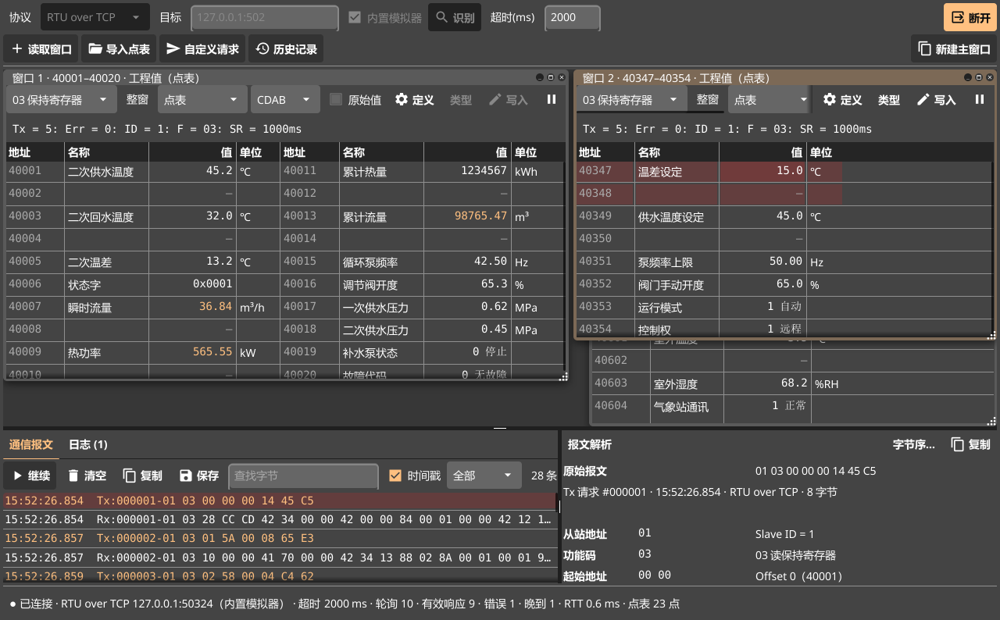

# 使用说明

Modbus AI Studio 的界面参考 Modbus Poll：一个主窗口里有若干个读取窗口，每个读取窗口按设定的周期读一段地址。和 Modbus Poll 不同的是，出错时会自动分析原因并给出一键处理，写入后会回读确认设备真的执行了。

- [界面一览](#界面一览)
- [连接设备](#连接设备)
- [读取数据](#读取数据)
- [点表与工程值](#点表与工程值)
- [写入与控制验证](#写入与控制验证)
- [出错时的自动分析](#出错时的自动分析)
- [报文：查看、解析、自定义请求](#报文查看解析自定义请求)
- [报文记录与历史](#报文记录与历史)
- [工作区与多开](#工作区与多开)
- [只读模式](#只读模式)
- [命令行工具](#命令行工具)
- [软件更新](#软件更新)
- [快捷键](#快捷键)

点表的格式见 [点表格式](points.md)，遇到问题先看 [常见问题](faq.md)。

## 界面一览



| 区域 | 作用 |
| --- | --- |
| 连接栏（顶部） | 协议、目标地址或串口参数、超时、连接 / 断开；右侧是“读取窗口”“自定义请求”和新建主窗口 |
| 读取窗口（中间） | 每个窗口读一段地址，自动平铺。标题栏有“定义”“写入”“暂停”“关闭” |
| 通信报文 / 日志（左下） | 报文页显示全部收发；日志页显示连接失败、读取失败与恢复、断开和重连 |
| 解析（右下） | 单击读取窗口里的值，显示它在各种类型和字节序下的解读；单击报文或日志，查看逐字段解析或故障分析 |
| 状态栏（底部） | 连接状态、超时、轮询次数、有效响应、错误、响应时间、点表点数；断开时显示重连进度 |

主窗口启动时是空的。想先看看效果，用“读取 → 打开换热站示例”：打开三个示例窗口，连接内置的换热站模拟器（截图就是这个示例，窗口 3 的地址段故意应答慢，演示自动分析）。

## 连接设备

1. **选协议**：Modbus TCP、RTU over TCP、ASCII over TCP、RTU 串口、ASCII 串口。
   - 普通 Modbus TCP 设备（PLC、仪表的网口）选 Modbus TCP。
   - 串口服务器、透传模块后面接的 485 设备，多数要选 RTU over TCP。
   - 不确定就点“识别”，会依次试 Modbus TCP、RTU、ASCII 三种格式。
2. **填目标**：网口填 `IP:端口`（Modbus 默认端口 502）；串口选端口、波特率和数据格式（8N1、8E1、8O1、8N2；ASCII 常用 7E1）。插上 USB 转 485 几秒内串口列表会自动刷新。
3. **点“连接”**（⌘K / Ctrl+K）。勾选“内置模拟器”时不用真设备，连本机的换热站模拟器。

超时可以在连接中直接改，立即生效。TCP 类连接中途断开会自动重连（1 / 2 / 5 / 10 s 逐步拉长间隔），状态栏显示进度和失败原因；串口断开多半是 USB 被拔掉，插回后点“重新连接”。不知道从站地址或串口参数时，用“调试 → 扫描从站地址”（试 Slave 1–247）和“连接 → 扫描串口参数”（试 8 种波特率 × 4 种数据格式），找到后一键填回。

## 读取数据

点“读取窗口”（⌘T）新建一个，在“定义”里设置：

| 项目 | 说明 |
| --- | --- |
| Slave ID | 从站地址，1–255（常用 1–247） |
| 功能码 | 01 读线圈、02 读离散输入、03 读保持寄存器、04 读输入寄存器 |
| 起始地址 | 支持多种写法，见下表；有歧义时会列出全部解释让你选 |
| 数量 | 寄存器或线圈的个数 |
| 扫描周期 | 多久读一次，20 ms–3600 s |
| 显示格式 | 工程值（点表）、Signed、Unsigned、Hex、Binary、ASCII、INT32 / UINT32 / FLOAT32、INT64 / UINT64 / FLOAT64 |
| 字节序 | 选项随显示格式变化：16 位格式 AB / BA（BA 是字节交换），32 位、64 位格式各四种，见 [字节序](points.md#字节序) |
| 每列行数 | 表格每列显示多少行，超出的分到右边一列 |

地址写法：

| 写法 | 含义 | 例子 |
| --- | --- | --- |
| 40001 起 | 保持寄存器，1 起始（手册最常见） | 40347 = 协议地址 346 |
| 30001 起 | 输入寄存器 | 30001 = 协议地址 0 |
| 4x0347、3x0001 | 同上的另一种写法 | 4x0347 = 协议地址 346 |
| 400001 起 | 6 位写法，地址超过 9999 时用 | 410001 = 协议地址 10000 |
| 346、0x015A | 协议里的原始地址（0 起始） | |

手册地址和协议地址差 1 是最常见的问题：手册写 40001，报文里是 0。读不到时先试试起始地址 ±1。

调试功能码和大小端时不用每次打开“定义”：每个读取窗口标题下面有一行**控制条**，选了马上按新设置读取和显示：

- **功能码**：01 线圈、02 离散输入、03 保持寄存器、04 输入寄存器。起始地址不变，换成对应数据区。
- **显示格式**：线圈、离散输入窗口没有格式。
- **字节序**：16 位格式 AB / BA，32 位、64 位格式各四种；按点表显示的窗口改的是本窗口里 32 / 64 位点的字节序。换格式时自动换成同一种字节序的写法（例如 BA 换到 FLOAT32 是 BADC）。
- **原始值**：多显示一列每个寄存器线上的十六进制原始值，对照着看字节序对不对。

名称、单位列按点表里文字的长短自动定宽。窗口高度不够时，表格至少保留表头和一行，出错时错误和一键处理优先显示，较长的说明可以在标题区里滚动查看。

窗口标题下的一行沿用 Modbus Poll 的写法：`Tx` 发送次数、`Err` 出错次数、`ID` 从站地址、`F` 功能码、`SR` 扫描周期。值刚变化时高亮；读取失败时保留上次读到的值并灰显。每个窗口可以单独暂停，“读取”菜单里有全部暂停 / 继续。

## 点表与工程值

设备寄存器里存的是**原始值**，往往要按数据类型、字节序、倍率换算才是有意义的**工程值**。例如：

| 地址 | 寄存器里的原始值 | 点表里这一行 | 显示的工程值 |
| --- | --- | --- | --- |
| 40005 | 132 | 二次温差，INT16，倍率 0.1，℃ | 13.2 ℃ |
| 40347–40348 | 0x0000 0x4170 | 温差设定，FLOAT32，CDAB | 15.0 ℃ |
| 40019 | 0 | 补水泵状态，枚举 0=停止;1=运行 | 0 停止 |

**点表**就是设备的地址表：每一行说明一个地址是什么、怎么换算。用“读取 → 导入点表”导入（xlsx 或 CSV，物联网平台导出的设备属性表也行）后，已有读取窗口自动改成“工程值（点表）”显示，多出名称、单位两列；没有被现有窗口完整覆盖的点会自动补建窗口。线圈、离散输入和两种寄存器都支持，不在点表里的地址显示原始值。点表还决定哪些点能写、允许的范围。每个主窗口各有一份点表，初始为空。

点表的写法见 [点表格式](points.md)，模板是 [assets/examples/heat-station-points.csv](../assets/examples/heat-station-points.csv)。

要调整字节序，选中点后点右侧解析面板的“字节序…”，或用“读取 → 调整点表字节序…”。可选单个点、本读取窗口覆盖的点、全部点，以及 ABCD / CDAB / BADC / DCBA；只有 32 / 64 位数值点会改变，已读到的值会立即按新字节序重显。

选中浮点值时，解析面板还会列出起始地址前移或后移一位、分别按可用字节序解出的候选值，并标注数值量级是否合理。两种读法有时都合理、甚至只在低位有差别；请对照设备面板上的值确认地址和字节序，程序不会自动替你选择。

## 写入与控制验证

双击值（或选中后点“写入”）打开写入对话框，对话框里会预览要发送的寄存器和完整报文：

- **点表里的可写点**：按工程值写，自动换算成原始值，检查是否在允许范围内；写入字节序和采集字节序不一致时会警告。
- **其他保持寄存器**：按窗口的显示格式写原始值，16 位格式可选 FC06 或 FC16，32 / 64 位格式用 FC16。Hex 格式写 `0x1234`，Binary 格式写 0 和 1；64 位整型也可以写 0x 开头的十六进制。
- **线圈**：写 ON / OFF，FC05 或 FC15。

收到写响应不等于设备执行了，所以确认后会在 0 / 200 / 1000 ms 各回读一次，给出结论：

| 结论 | 含义 | 常见原因 |
| --- | --- | --- |
| PASS | 三次回读都等于目标值 | |
| 未生效 | 回读一直是原值 | 地址不对、点位只读、设备在本地模式或有联锁 |
| 被覆盖 | 先变成目标值，又被改回 | PLC 程序或设备逻辑在覆盖这个值 |
| 值不符 | 变了，但不等于目标 | 字节序、类型、倍率配错；会尝试其他字节序，找到能对上的就直接指出 |
| 无法判断 | 写入超时且回读失败 | 通信问题 |
| 协议拒绝 | 设备回了异常码 | 见 [异常码](faq.md#异常码) |

结论不是 PASS 且值已经变了时，可以一键恢复原值（按读到的原始寄存器写回）。整型按原始值逐位比较，64 位大数也不会误判。

## 出错时的自动分析

读取窗口出错（Err ≠ 0）时，标题下方给出原因、说明和一键处理按钮。分析只依据错误类型、协议和本次连接里的通信记录，不靠猜测。常见情况：

| 现象 | 分析 | 一键处理 |
| --- | --- | --- |
| 超时，但报文里有晚到响应 | 设备有应答，只是慢 | 超时改为合适的值 |
| 超时，同一连接上其他请求正常 | 链路没问题，这个站号可能不存在 | 扫描从站地址 |
| Modbus TCP 一直超时 | 设备可能是 RTU over TCP | 识别协议 |
| 串口一直超时 | 串口参数、站号或接线不对 | 扫描串口参数 |
| 异常 01 | 设备不支持这个功能码 | 改用 FC03 / FC04 |
| 异常 02 | 地址越界或差 1 | 逐个探测可读地址 |
| 异常 03 | 一次读得太多 | 数量减半 |
| 异常 06 | 设备忙 | 扫描周期加倍 |
| CRC / LRC 错误 | 波特率、校验位不一致或线路干扰 | |
| FLOAT32 / FLOAT64 值不合理（灰色） | 字节序可能不对 | 改用合理的字节序 |
| 连接断开 | 按断开发生的时机分析，见 [连接断开](faq.md#连接断开) | 识别协议、暂停这条请求、调扫描周期等 |

## 报文：查看、解析、自定义请求



- **通信报文**：每条收发一行，可按“仅错误”筛选、按字节查找、复制、保存为文本。单击一行会暂停滚动，右下角逐字段解析：MBAP 头或从站地址、功能码、地址、每个寄存器的值、CRC（含正确值）、异常码含义。ASCII 帧按字符显示。
- **日志**：左下角切换到“日志”，查看连接失败、读取失败与恢复、断开和重连。连续出现的同类读取错误只记一次，恢复时再记一条。单击日志可在右侧查看原因分析，以及出错请求和响应的原始报文解析；“清空”只清除当前列表，历史记录仍保存在数据库中。
- **自定义请求**（⌘R）：输入 PDU，自动加 MBAP 头或 CRC，预览完整报文，可循环发送，请求和响应都逐字段解析。内置常用模板，FC07、08、11、17、20–24、43（读设备标识）等不常用功能码在这里发。
- **诊断计数器**：“调试 → 读取诊断计数器”用 FC08 读出设备统计的总线报文数、通信错误、异常、无响应次数，可一键清零。

## 报文记录与历史

连接期间的全部收发，包括超时、异常、校验错误、晚到响应，以及连接失败、读取失败与恢复、断开和重连日志，都自动存进本机的 SQLite 数据库，保留 7 天。所有主窗口共用一个数据库；报文批量写入，故障日志发生时立即写入。

| 系统 | 数据库位置 |
| --- | --- |
| Windows | `%AppData%\ModbusAIStudio\packets.db` |
| macOS | `~/Library/Application Support/ModbusAIStudio/packets.db` |
| Linux | `~/.config/ModbusAIStudio/packets.db` |

“调试 → 历史报文”打开时显示最近一次连接，也可以选别的连接查看报文（最后 5000 条）和日志，会话列表里有错误数、故障数和断开次数。即使连接失败、没有收发报文，也能选中该会话查看日志。窗口底部显示数据库路径，旁边的“打开数据库”用系统里的 SQLite 工具（例如 DB Browser for SQLite）直接打开，“所在文件夹”在访达 / 资源管理器里显示它；“调试”菜单里也有这两项。没有能打开 .db 文件的程序时会改为在文件夹里显示。历史报文窗口只开一个，再点会切到已打开的那个。也可以直接用 SQLite 工具打开数据库：

| 表 | 内容 |
| --- | --- |
| `sessions` | 每次连接：开始、结束时间（为空表示没有正常断开）、协议、目标、主窗口编号 |
| `packets` | 每条收发：时间、方向、站号、功能码、地址、原始字节、`status`（SUCCESS、TIMEOUT、EXCEPTION、CRC_ERROR、LATE_RESPONSE 等）、响应时间、错误说明 |
| `events` | 连接失败（CONNECT_FAIL）、读取失败（READ_FAIL）、恢复（READ_OK）、断开（DISCONNECT）、重连（RECONNECT）；含故障结论、窗口编号、分析文字、请求 `tx` 和响应 `rx` 原始字节 |

```sql
-- 最近 50 条出错的请求
SELECT datetime(time/1000000, 'unixepoch', 'localtime'), function, address, status, error
FROM packets WHERE status NOT IN ('SENT', 'SUCCESS') ORDER BY id DESC LIMIT 50;

-- 最近 50 条故障和恢复日志
SELECT datetime(time/1000, 'unixepoch', 'localtime'), kind, window, detail, analysis, hex(tx), hex(rx)
FROM events ORDER BY id DESC LIMIT 50;
```

程序运行时最新的记录还在旁边的 `packets.db-wal` 文件里。要把数据库拷走，先关掉程序，或者把 `.db`、`-wal`、`-shm` 三个文件一起拷。

## 工作区与多开

- **工作区**（⌘S 保存、⌘O 打开）：连接参数、全部读取窗口、点表和只读模式存成一个 JSON 文件，打开后不会自动连接。空白主窗口列出最近打开的 5 个工作区。
- **多开**：“文件 → 新建窗口”（⌘N）或连接栏最右侧的按钮打开新的主窗口，各自有独立的连接、读取窗口和报文，可以同时调试多台设备；新窗口沿用当前的协议和目标。同一个串口同一时刻只能被一个窗口打开。关掉最后一个主窗口才退出。

## 只读模式

在运行中的生产设备上排查问题时，打开“连接 → 只读模式（禁止写入）”，状态栏会显示“只读模式”：

- 写入对话框不能用，诊断计数器不能清零。
- 自定义请求只放行读类请求：读线圈 / 离散输入 / 保持寄存器 / 输入寄存器、读异常状态、通信事件、报告从站 ID、读文件记录、读 FIFO、读设备标识，以及 FC08 里只读的子功能。其他功能码，包括设备自定义的，一律拦下，不会发出去。
- 设置随工作区保存，生产设备的工作区打开就是只读；新建的主窗口继承当前设置。

## 命令行工具

Windows 包里附带 `modbus-cli.exe`（命令行主站）和 `modbus-sim.exe`（模拟从站），适合脚本和没有图形界面的场合。

```sh
# 读 4 个 FLOAT32（字节序 CDAB）
modbus-cli -target 192.168.1.10:502 -type float32 -order CDAB read 40001 4
# 写入并立即回读确认
modbus-cli -target 192.168.1.10:502 -type float32 -order CDAB write 40347 16
# 64 位整型精确读写
modbus-cli -target 192.168.1.10:502 -type uint64 -order CDAB read 40701 4
# 串口
modbus-cli -port COM3 -baud 9600 -parity E read 40001 10
# 识别协议
modbus-cli -target 192.168.1.10:502 detect

# 模拟从站，可注入延迟、丢包、CRC 错误等故障
modbus-sim -listen 127.0.0.1:1502 -mode rtu-over-tcp
```

`modbus-cli -h` 列出全部选项：协议（`-mode`）、站号、超时、数据位 / 校验位 / 停止位、倍率、打印报文（`-trace`）等。

## 软件更新

“帮助 → 检查更新…”同时查询 Gitee 镜像和 GitHub Releases，取最新的版本（一样新时优先 Gitee，国内下载快）；一边的安装包下载不了时自动换另一边接着下。有新版本时列出更新内容，可以：

- **下载并安装**：下载本机对应的安装包（Windows 绿色版 zip、macOS 的 Intel 或 Apple Silicon DMG），按发布说明里的 SHA-256 校验，校验不过不会安装。Windows 替换 `ModbusAIStudio.exe` 所在目录里的程序文件（工作区等其他文件不动），macOS 替换正在运行的 .app，装好后问是否立即重启。网络慢时可以点“后台下载”接着用程序，状态栏显示下载进度；网络断开或卡住时自动接着下，取消或关掉程序后下次从断开处继续。
- **打开下载页面**：手动下载。程序目录没有写入权限、从源码运行、Linux 时只能这样。

程序启动几秒后会自动检查一次（每天最多一次，查不到不打扰）；自动检查时可以选“跳过这个版本”。不需要时关掉“帮助 → 自动检查更新”。

## 快捷键

macOS 用 ⌘，Windows、Linux 用 Ctrl（⇧ 是 Shift）。菜单里每一项的右边也写着快捷键；焦点在输入框里时同样能用。

| 快捷键 | 功能 |
| --- | --- |
| ⌘N | 新建主窗口 |
| ⌘O / ⌘S | 打开 / 保存工作区 |
| ⌘⇧S | 工作区另存为 |
| ⌘W | 关闭主窗口 |
| ⌘K | 连接 / 断开 |
| ⌘D | 识别协议 |
| ⌘T | 新建读取窗口 |
| ⌘E | 当前读取窗口的读取定义 |
| ⌘↩ | 写入当前读取窗口里选中的值（与双击值相同） |
| ⌘P | 暂停 / 继续当前读取窗口 |
| ⌘⇧P / ⌘⇧R | 全部暂停 / 全部继续 |
| ⌘I | 导入点表 |
| ⌘R | 自定义请求 |
| ⌘⇧H | 历史报文 |
| ⌘L | 清空通信报文 |

**当前读取窗口**是最近点过的那个（点窗口里任何地方都算，包括标题和状态行），或者用“新建读取窗口”刚建的；有多个读取窗口时它有一圈高亮边框、标题高亮。打开示例、导入点表、打开工作区一次建多个窗口时，当前窗口是第一个；它被关掉后也取第一个。同一时间只有一个选中的值：点到另一个窗口时，原来窗口里的选中会取消。读取窗口里可以用方向键移动、空格选中，再按 ⌘↩ 写入。

对话框打开时，菜单和快捷键里会弹对话框的操作（定义、写入、调整字节序、导入点表、工作区、识别、扫描、检查更新等）不再响应，不会一层层叠起来。历史报文、自定义请求窗口各只开一个，再点会切到已打开的那个。
