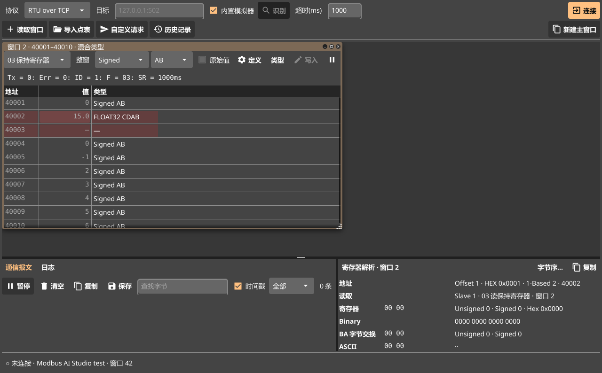
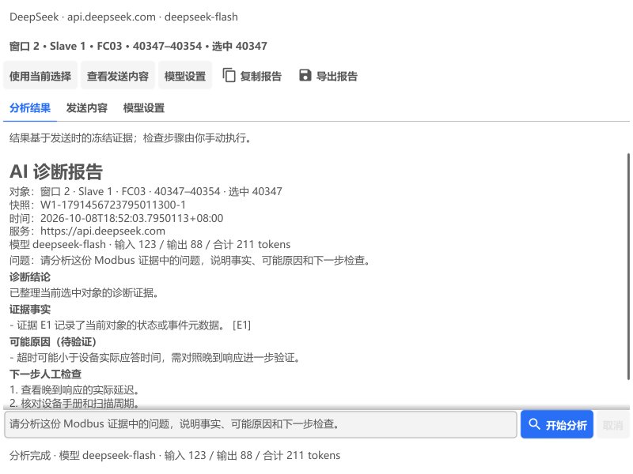

# 使用说明

Modbus AI Studio 的界面参考 Modbus Poll：一个主窗口里有若干个读取窗口，每个读取窗口按设定的周期读一段地址。和 Modbus Poll 不同的是，出错时会自动分析原因并给出一键处理，写入后会回读确认设备真的执行了。

- [界面一览](#界面一览)
- [连接设备](#连接设备)
- [读取数据](#读取数据)
- [点表与工程值](#点表与工程值)
- [写入与控制验证](#写入与控制验证)
- [出错时的自动分析](#出错时的自动分析)
- [DeepSeek AI 诊断助手](#deepseek-ai-诊断助手)
- [报文：查看、解析、自定义请求](#报文查看解析自定义请求)
- [报文记录与历史](#报文记录与历史)
- [工作区与多开](#工作区与多开)
- [只读模式](#只读模式)
- [命令行工具](#命令行工具)
- [软件更新](#软件更新)
- [快捷键](#快捷键)

点表的格式见 [点表格式](points.md)，遇到问题先看 [常见问题](faq.md)。

## 界面一览


| 区域 | 作用 |
| --- | --- |
| 连接栏（顶部） | 协议、目标地址或串口参数、超时和连接 / 断开按钮；按钮旁显示未连接、连接中、已连接、连接失败或重连中；窄窗口下整组参数自动换行 |
| 操作栏（顶部第二行） | 新建读取窗口、全部暂停 / 继续、检测寄存器、导入点表、自定义请求、历史记录、新建主窗口和只读模式 |
| 读取窗口（中间） | 每个窗口读一段地址，是可以拖动、改大小、最大化的子窗口，新窗口层叠摆放（和 Modbus Poll 一样，不并列）。第一行是控制条和“定义”“写入”“暂停” |
| 通信报文 / 日志（左下） | 报文页显示全部收发；日志页显示连接失败、读取失败与恢复、断开和重连 |
| 解析（右下） | 单击读取窗口里的值，显示它在各种类型和字节序下的解读；单击报文或日志，查看逐字段解析或故障分析 |
| 状态栏（底部） | 连接状态、超时、轮询次数、有效响应、错误、响应时间、点表点数；断开时显示重连进度 |

主窗口启动时显示“新建读取窗口”和“打开换热站示例”入口。想先看看效果，点击“打开换热站示例”或使用同名读取菜单：打开三个示例窗口，连接内置的换热站模拟器（截图就是这个示例，窗口 3 的地址段故意应答慢，演示自动分析）。

应用在系统托盘保留图标。主窗口右上角的关闭按钮默认隐藏窗口，连接和采集继续；左键托盘图标恢复最近的主窗口，右键菜单可选择工作区、打开新主窗口或退出本实例的所有窗口。“文件 → 关闭窗口”（Ctrl+W）真正关闭当前工作区；“文件 → 退出程序”退出本实例。在“视图”菜单可关闭“关闭按钮隐藏到托盘”，也可恢复默认窗口大小与分隔比例。

可以再次双击程序运行多个独立实例，也可以使用“文件 → 新建窗口”。不同实例的托盘菜单标有进程号，避免退出错实例。主窗口默认 1240 × 760 逻辑尺寸，按屏幕可用区域与 DPI 缩放收进屏幕内，并记住上次隐藏或关闭时的大小；历史和调试工具窗口也会按屏幕限尺寸。

## 连接设备

1. **选协议**：Modbus TCP、RTU over TCP、ASCII over TCP、RTU 串口、ASCII 串口。
   - 普通 Modbus TCP 设备（PLC、仪表的网口）选 Modbus TCP。
   - 串口服务器、透传模块后面接的 485 设备，多数要选 RTU over TCP。
   - 不确定就点“识别”，会依次试 Modbus TCP、RTU、ASCII 三种格式。
2. **填目标**：网口填 `IP:端口`（Modbus 默认端口 502）；串口选端口、波特率和数据格式（8N1、8E1、8O1、8N2；ASCII 常用 7E1）。插上 USB 转 485 几秒内串口列表会自动刷新。
3. **点“连接”**（Ctrl+K，macOS ⌘K）。勾选“内置模拟器”时不用真设备，连本机的换热站模拟器。

建立连接期间，连接参数暂时锁定，顶部和底部都显示“连接中”；连接失败后恢复输入，底部保留失败原因，便于修改参数后重试。连接建立后，超时可以直接改，按回车后立即生效。TCP 类连接中途断开会自动重连（1 / 2 / 5 / 10 s 逐步拉长间隔），顶部显示“重连中”，状态栏显示断开、重连进度和失败原因；串口断开多半是 USB 被拔掉，插回后点“重新连接”。不知道从站地址或串口参数时，用“调试 → 扫描从站地址”（试 Slave 1–247）和“连接 → 扫描串口参数”（试 8 种波特率 × 4 种数据格式），找到后一键填回。

## 读取数据

点“新建读取窗口”（Ctrl+T）新建一个，在“定义”里设置：

| 项目 | 说明 |
| --- | --- |
| Slave ID | 从站地址，1–255（常用 1–247） |
| 功能码 | 01 读线圈、02 读离散输入、03 读保持寄存器、04 读输入寄存器 |
| 起始地址 | 支持多种写法，见下表；有歧义时会列出全部解释让你选 |
| 数量 | 寄存器或线圈的个数 |
| 扫描周期 | 多久读一次，20 ms–3600 s |
| 显示格式 | 工程值（点表）、Signed、Unsigned、Hex、Binary、ASCII、INT32 / UINT32 / FLOAT32、INT64 / UINT64 / FLOAT64 |
| 字节序 | 选项随显示格式变化：16 位格式 AB / BA（BA 是字节交换），32 位、64 位格式各四种，见 [字节序](points.md#字节序) |
| 每列行数 | 表格每列显示多少行，超出的分到右边一列 |

地址写法：

| 写法 | 含义 | 例子 |
| --- | --- | --- |
| 40001 起 | 保持寄存器，1 起始（手册最常见） | 40347 = 协议地址 346 |
| 30001 起 | 输入寄存器 | 30001 = 协议地址 0 |
| 4x0347、3x0001 | 同上的另一种写法 | 4x0347 = 协议地址 346 |
| 400001 起 | 6 位写法，地址超过 9999 时用 | 410001 = 协议地址 10000 |
| 346、0x015A | 协议里的原始地址（0 起始） | |

手册地址和协议地址差 1 是最常见的问题：手册写 40001，报文里是 0。读不到时先试试起始地址 ±1。

读取窗口顶部的功能码、显示格式、字节序和操作按钮随宽度自动换行。“暂停 / 继续”使用文字按钮，状态直接显示未连接、连接中、等待数据、读取正常、读取失败、检测中或已暂停。错误说明单独占用完整宽度，下方提供处理操作和 AI 分析；子窗口高度不足时可滚动顶部区域查看说明与统计，寄存器表格保留独立区域。

读取窗口照 Modbus Poll 的习惯排列和操作：

- **子窗口**：拖标题栏移动，拖右下角改大小，标题栏右侧的按钮最大化 / 还原、关闭。最大化后切换窗口仍保持最大化。点窗口任何地方（标题栏、表格、状态行）都把它提到最上面，成为当前窗口，标题栏变成蓝色。
- **“窗口”菜单**：层叠、平铺、最大化，下面列出全部读取窗口，点一个切过去。
- **键盘**：方向键直接移动选中，上下一次走一个值（FLOAT32 等 32 / 64 位值和多寄存器点整体移动），左右换到相邻一列；Enter 写入选中的值；Ctrl+C复制选中的一行（地址、名称、值、单位，制表符分隔，可直接粘贴进 Excel）。
- **右键菜单**：右键单元格可以写入、复制，改显示格式、字节序、原始值（当前的打勾），打开读取定义、功能码 / 数据类型 / 字节序调试窗口，逐个探测可读地址。

调试功能码和大小端时不用每次打开“定义”：每个读取窗口第一行是**控制条**，选了马上按新设置读取和显示：

- **功能码**：01 线圈、02 离散输入、03 保持寄存器、04 输入寄存器。起始地址不变，换成对应数据区。
- **显示格式**：线圈、离散输入窗口没有格式。
- **字节序**：16 位格式 AB / BA，32 位、64 位格式各四种；按点表显示的窗口改的是本窗口里 32 / 64 位点的字节序。换格式时自动换成同一种字节序的写法（例如 BA 换到 FLOAT32 是 BADC）。
- **原始值**：多显示一列每个寄存器线上的十六进制原始值，对照着看字节序对不对。

名称、单位列按点表里文字的长短自动定宽。窗口高度不够时，表格至少保留表头和一行，出错时错误和一键处理优先显示，较长的说明可以在标题区里滚动查看。

控制条下面的一行沿用 Modbus Poll 的写法：`Tx` 发送次数、`Err` 出错次数、`ID` 从站地址、`F` 功能码、`SR` 扫描周期。值刚变化时高亮；读取失败时保留上次读到的值并灰显。每个窗口可以单独暂停，操作栏和“读取”菜单都有全部暂停 / 继续。工具栏按钮随各窗口状态同步：只要还有窗口未暂停，点击会暂停全部；全部暂停后，点击会继续全部。没有读取窗口时按钮禁用。

### 功能码 / 数据类型 / 字节序调试

对接新设备、手册不全时，不知道该用哪个功能码、数据是 INT32 还是 FLOAT32、字节序是哪种，用“调试 → 功能码 / 数据类型 / 字节序调试…”（Ctrl+B），或在读取窗口里右键单元格打开。它按当前读取窗口填好 Slave、功能码，从选中的地址开始读：

- **各字节序并排**：同一批寄存器按所选数据类型的每种字节序各解一列（16 位 AB / BA，32 位、64 位各四种），左边是线上的原始寄存器。浮点数不合理的灰显，上方统计每种字节序有几个合理值，合理值最多的那种在表头打 ✓、并在下方预先选好。数据全是 0、几种一样合理或都不合理时会说明，并提示换地址或起始地址 ±1。
- **换数据类型不用重读**：在 INT16、UINT16、INT32、UINT32、FLOAT32、INT64、UINT64、FLOAT64 之间切换，表格立即按新类型重新解读刚读到的数据。
- **探测功能码**：依次用 03、04、01、02 读同一个地址和数量，列出每个功能码是正常响应、异常还是超时；当前功能码读不了、别的能读时，自动切过去重新读。
- **应用**：选好字节序后点“应用到当前读取窗口”（功能码、地址、数量、数据类型、字节序一起改，名称、扫描周期等保留）或“新建读取窗口”。
- 可勾选“自动刷新”按周期重读；“复制表格”复制成制表符分隔的文字。请求和读取窗口共用同一条连接，收发同样记在通信报文里。

## 点表与工程值

### 单个或多个寄存器的数据类型

单击选中一个值，按住 Shift 点击末尾值或拖动鼠标，可按连续地址选中多个寄存器。右键选择“设置寄存器数据类型…”或点击读取窗口的“类型”，设置起始 Offset、寄存器数量、数据类型和字节序；右键“显示格式”也可直接应用到当前选择。类型支持 Signed / Unsigned（16 位）、INT32 / UINT32 / FLOAT32、INT64 / UINT64 / FLOAT64，以及 Hex、Binary、ASCII。

32 位值占 2 个寄存器，64 位值占 4 个；批量设置时，数量须为 2 / 4 的倍数，不能超出读取范围。组合值显示在起始地址，后续寄存器显示“—”。同一窗口中可以混用不同类型，局部设置不影响其他窗口，并随工作区保存。混合类型时显示“类型”列；复制、解析及单值写入使用对应值的类型与字节序。右键“恢复选中寄存器默认格式”清除局部设置；控制条标为“整窗”的格式选项会统一设置整个窗口。

设置类型只改变解码和显示，不会修改设备数据。切换 Slave ID 或功能码后清除局部格式，避免沿用其他设备的数据解释。选中多个值时，单值写入按钮不可用。

如果局部设置只覆盖了原有组合值的一部分，剩余寄存器会按原始 Unsigned 显示，避免重复解码。起始 Offset 从 0 开始，例如参考地址 40002 对应 Offset 1。



设备寄存器里存的是**原始值**，往往要按数据类型、字节序、倍率换算才是有意义的**工程值**。例如：

| 地址 | 寄存器里的原始值 | 点表里这一行 | 显示的工程值 |
| --- | --- | --- | --- |
| 40005 | 132 | 二次温差，INT16，倍率 0.1，℃ | 13.2 ℃ |
| 40347–40348 | 0x0000 0x4170 | 温差设定，FLOAT32，CDAB | 15.0 ℃ |
| 40019 | 0 | 补水泵状态，枚举 0=停止;1=运行 | 0 停止 |

**点表**就是设备的地址表：每一行说明一个地址是什么、怎么换算。用“读取 → 导入点表”导入（xlsx 或 CSV，物联网平台导出的设备属性表也行）后，已有读取窗口自动改成“工程值（点表）”显示，多出名称、单位两列；没有被现有窗口完整覆盖的点会自动补建窗口。线圈、离散输入和两种寄存器都支持，不在点表里的地址显示原始值。点表还决定哪些点能写、允许的范围。每个主窗口各有一份点表，初始为空。

点表的写法见 [点表格式](points.md)，模板是 [assets/examples/heat-station-points.csv](../assets/examples/heat-station-points.csv)。

要调整字节序，选中点后点右侧解析面板的“字节序…”，或用“读取 → 调整点表字节序…”。可选单个点、本读取窗口覆盖的点、全部点，以及 ABCD / CDAB / BADC / DCBA；只有 32 / 64 位数值点会改变，已读到的值会立即按新字节序重显。

选中浮点值时，解析面板还会列出起始地址前移或后移一位、分别按可用字节序解出的候选值，并标注数值量级是否合理。两种读法有时都合理、甚至只在低位有差别；请对照设备面板上的值确认地址和字节序，程序不会自动替你选择。

## 写入与控制验证

双击值（或选中后点“写入”）打开写入对话框，对话框里会预览要发送的寄存器和完整报文：

- **点表里的可写点**：按工程值写，自动换算成原始值，检查是否在允许范围内；写入字节序和采集字节序不一致时会警告。
- **其他保持寄存器**：按窗口的显示格式写原始值，16 位格式可选 FC06 或 FC16，32 / 64 位格式用 FC16。Hex 格式写 `0x1234`，Binary 格式写 0 和 1；64 位整型也可以写 0x 开头的十六进制。
- **线圈**：写 ON / OFF，FC05 或 FC15。

收到写响应不等于设备执行了，所以确认后会在 0 / 200 / 1000 ms 各回读一次，给出结论：

| 结论 | 含义 | 常见原因 |
| --- | --- | --- |
| PASS | 三次回读都等于目标值 | |
| 未生效 | 回读一直是原值 | 地址不对、点位只读、设备在本地模式或有联锁 |
| 被覆盖 | 先变成目标值，又被改回 | PLC 程序或设备逻辑在覆盖这个值 |
| 值不符 | 变了，但不等于目标 | 字节序、类型、倍率配错；会尝试其他字节序，找到能对上的就直接指出 |
| 无法判断 | 写入超时且回读失败 | 通信问题 |
| 协议拒绝 | 设备回了异常码 | 见 [异常码](faq.md#异常码) |

结论不是 PASS 且值已经变了时，可以一键恢复原值（按读到的原始寄存器写回）。整型按原始值逐位比较，64 位大数也不会误判。

## 出错时的自动分析

读取窗口出错（Err ≠ 0）时，标题下方给出原因、说明和一键处理按钮。分析只依据错误类型、协议和本次连接里的通信记录，不靠猜测。常见情况：

| 现象 | 分析 | 一键处理 |
| --- | --- | --- |
| 超时，但报文里有晚到响应 | 设备有应答，只是慢 | 超时改为合适的值 |
| 超时，同一连接上其他请求正常 | 链路没问题，这个站号可能不存在 | 扫描从站地址 |
| Modbus TCP 一直超时 | 设备可能是 RTU over TCP | 识别协议 |
| 串口一直超时 | 串口参数、站号或接线不对 | 扫描串口参数 |
| 异常 01 | 设备不支持这个功能码 | 改用 FC03 / FC04 |
| 异常 02 | 地址越界或差 1 | 逐个探测可读地址 |
| 异常 03 | 一次读得太多 | 数量减半 |
| 异常 06 | 设备忙 | 扫描周期加倍 |
| CRC / LRC 错误 | 波特率、校验位不一致或线路干扰 | |
| FLOAT32 / FLOAT64 值不合理（灰色） | 字节序可能不对 | 改用合理的字节序 |
| 连接断开 | 按断开发生的时机分析，见 [连接断开](faq.md#连接断开) | 识别协议、暂停这条请求、调扫描周期等 |

## DeepSeek AI 诊断助手

打开“调试 → AI 诊断助手”，也可点击读取窗口错误 / 诊断行的“AI分析”，或在选中报文、日志、寄存器后点击解析面板的“AI解释”。每个工作区独立打开一个助手窗口，顶部始终突出显示本次分析的来源对象，操作按钮随窗口宽度换行。解析面板的 AI、复制和字节序操作集中在标题行。



1. 在“模型设置”填写 DeepSeek API Key，模型默认 `deepseek-flash`。点“保存设置”后，再点“测试 DeepSeek 连接”；连接测试只发送合成证据，不发送设备数据。
2. 选择要解释的报文、日志或寄存器，或点击需要诊断的读取窗口的“AI分析”。助手打开时冻结证据；需要更换对象时点击“使用当前选择”。从故障行打开时固定绑定该读取窗口，从寄存器解析打开时还固定选中地址，切换其他窗口不会改变它。来源窗口已关闭或选中地址移出读取范围时，更新证据会提示重新选择。
3. 在“发送内容”检查实际快照。默认只包含读取定义、通信状态和相关报文元数据，不包含主机、串口、路径、点名称、日志自由文本、自由格式传输错误、原始报文和寄存器值。读取窗口可勾选发送寄存器值；各类对象可勾选原始报文，原始报文也可能包含过程值。报文目标只发送选中的报文，日志目标只发送该日志的类型、时间和可验证的请求 / 响应元数据；不会混入当前读取状态。历史日志按记录时的协议校验帧，协议未知、校验错误、请求响应不匹配或未保存的状态标记为未知。
4. 描述问题后点“开始分析”。等待期间仍可正常采集，可取消请求；60 秒内没有完成会提示超时，需要手动重试。
5. 查看分节显示的结论、带证据编号的事实、可能原因和最多三项人工检查。通过“发送内容”的 `E1` 等编号核对来源；成功后“复制报告”复制包含对象、快照编号、模型及 token 使用量的 Markdown 报告。“导出报告”保存 `.md` 文件，并附发送时的冻结证据 JSON；导出内容不会随后续切换对象而改变。首次分析生成中、取消或失败时没有可导出的报告；对同一份证据重新分析时，上次成功报告仍可复制和导出，重试失败或取消也会保留，并在状态中说明。切换来源或更新证据会清除旧报告。写入或文件关闭失败会提示错误。

证据冻结后，后续轮询不会修改它；再次提问仍使用同一份证据。当前版本不保留多轮聊天历史。读取窗口的近期报文尚未保存完整连接代次，不能仅凭 `request_id` 将不同连接记录归为同一个请求；历史报文和日志则与当前读取数据隔离。AI 的判断需要现场验证，检查建议由使用者手动执行。

近期读取证据按从站、功能码、起始地址和数量匹配；未记录的延迟省略，已记录的延迟保留亚毫秒精度。发送前会检查证据编号，编号为空或重复时不会调用模型。

请求固定发送到 `https://api.deepseek.com/chat/completions`。Windows 勾选加密保存后，密钥保存在 `%AppData%\ModbusAIStudio\deepseek.key`，由 Windows 当前用户 DPAPI 加密；它不会进入工作区文件或 SQLite 报文数据库。取消勾选并保存设置会删除已保存的密钥；“删除已保存密钥”也会清空本助手窗口的密钥。其他系统仅支持当前会话输入或 `DEEPSEEK_API_KEY` 环境变量；环境变量在新助手窗口打开时读取。界面中可以修改模型名称。

连接失败时界面会区分密钥失效（401）、余额不足（402）、频率限制（429）、服务不可用及网络问题。不会自动重试请求。回答被截断、JSON 无效或引用不存在的证据时会拒绝显示为有效诊断。

## 检测寄存器地址

连接设备后，打开“调试 → 检测寄存器”。填写 Slave ID、功能码、起始 Offset 和检测数量；默认沿用当前读取窗口的参数，没有读取窗口时也可检测。支持 FC01 线圈、FC02 离散输入、FC03 保持寄存器、FC04 输入寄存器。

起始 Offset 是从 0 开始的协议地址：保持寄存器 `40001` 对应 Offset `0`，`40347` 对应 Offset `346`；也可输入 `0x015A` 这样的十六进制 Offset。对话框会显示实际检测的地址范围，先核对再开始。数量可以超过一次读取的限制，程序按协议上限分批检测；起始 Offset 加数量不能超过 65536。

| 结果 | 含义 |
| --- | --- |
| 可读 | 包含该地址的批量请求或单地址请求收到正常响应 |
| 非法地址（异常 02） | 设备拒绝用当前功能码读取该单个地址，可能是未定义、无权访问或设备对单地址读取有限制 |
| 无法判断 | 超时、校验或连接错误，或设备返回功能码不支持、设备忙等其他异常；保留停止原因 |
| 未检测 | 停止时尚未得到完整检测结果的地址，包括被中断的请求 |

正常地址段先批量读取；返回异常 02 时拆分检测，最终定位到单个非法地址。批量请求返回其他异常时，改为逐个检测该段。Modbus TCP 批量超时后逐个检测，单地址超时或网关返回异常 0B 时，标为“未响应 / 疑似未转发”并继续，最后复核未响应地址，避免迟到的批量响应拖慢后续读取而误报。RTU / ASCII（包括透传 TCP）没有事务编号，超时后会停止并将相关区段标为无法判断，避免迟到响应归错地址；请增大超时并重新连接后检测。连接错误或其他单地址异常会停止。“停止”保留已完成的结果，“复制结果”复制全部地址段、数量和停止原因。检测期间暂停同一连接的读取窗口，结束后恢复各窗口原来的暂停状态。

例如当前读取窗口是 `40001–40100`，下位机未转发 `40010`、`40015`、`40020`：点击主界面“检测寄存器”，默认 Offset `0`、数量 `100`，检测结果会分别列出这三个地址。如果设备返回异常 02，归为非法地址；使用 Modbus TCP 时，单地址未响应或返回网关异常 0B 归为疑似未转发，并继续检测其余地址。

读取窗口右键里的“逐个探测可读地址”和异常 02 的一键处理使用相同逻辑，并可将该窗口改为读取最长的可读地址段。非法地址是当前请求被设备拒绝的证据，不能单凭它证明物理寄存器不存在；部分设备即使地址未定义也返回零，这种情况需要结合点表或设备手册判断。

## 报文：查看、解析、自定义请求


- **通信报文**：每条收发一行，可按“全部”“仅错误”“仅发送”“仅接收”筛选，并配合字节查找；“仅错误”保留出错请求的发送行，方便对照。“清除筛选”一键恢复全部报文。报文操作、筛选控件和计数排在同一行，随面板宽度换行；主窗口上方的读取窗口区默认约占七成高度，可拖动分隔线调整。空列表会区分暂无报文、没有匹配和显示已暂停，暂停时“继续”按钮突出显示；历史记录保持静态浏览，不显示暂停或继续提示。计数显示“显示 N / M · 累计 T”：N 是当前筛选条数，M 是内存保留条数（最多 5000），T 是上次清空以来收到的全部条数。暂停时显示待显示条数，采集与数据库记录继续。复制、保存仅包含当前可见报文。单击一行会暂停滚动，右下角逐字段解析：MBAP 头或从站地址、功能码、地址、每个寄存器的值、CRC（含正确值）、异常码含义。ASCII 帧按字符显示。修改筛选或清空列表会清除原来选中的报文及其解析，避免与新列表错位。
- **日志**：左下角切换到“日志”，查看连接失败、读取失败与恢复、断开和重连。连续出现的同类读取错误只记一次，恢复时再记一条。单击日志可在右侧查看原因分析，以及出错请求和响应的原始报文解析；“清空”只清除当前列表，历史记录仍保存在数据库中。
- **自定义请求**（Ctrl+R）：输入 PDU，自动加 MBAP 头或 CRC，预览完整报文，可循环发送，请求和响应都逐字段解析。内置常用模板，FC07、08、11、17、20–24、43（读设备标识）等不常用功能码在这里发。
- **诊断计数器**：“调试 → 读取诊断计数器”用 FC08 读出设备统计的总线报文数、通信错误、异常、无响应次数，可一键清零。

## 报文记录与历史

连接期间的全部收发，包括超时、异常、校验错误、晚到响应，以及连接失败、读取失败与恢复、断开和重连日志，都自动存进本机的 SQLite 数据库。单个数据库文件上限为 50 MB（50,000,000 字节），写满自动切换到 `packets-000001.db`、`packets-000002.db` 等新文件，旧文件保留，不再按 7 天自动删除。所有主窗口共用记录器；报文批量写入，故障日志发生时立即写入。

程序重启后继续最新编号文件。切换文件时设备连接和采集继续，同一连接的记录可能分布在多个文件中，各文件均包含查询所需的会话信息。如果升级前的数据库已经超过 50 MB，会保留原文件并新建文件继续写入。

| 系统 | 数据库位置 |
| --- | --- |
| Windows | `%AppData%\ModbusAIStudio\packets.db` |
| macOS | `~/Library/Application Support/ModbusAIStudio/packets.db` |
| Linux | `~/.config/ModbusAIStudio/packets.db` |

点击主界面的“历史记录”或“调试 → 历史报文”，在程序内查看报文（最后 5000 条）和日志，无需安装 SQLite 工具。顶部“数据库文件”选择当前文件或旧文件，再选择该文件中的连接；会话列表显示错误数、故障数和断开次数。即使连接失败、没有收发报文，也能查看该会话的日志。“刷新”更新文件列表并重新加载该会话的记录；选择当前文件时，刷新会跟随新文件，选择旧文件时保留所选文件。

数据库是程序自动创建和维护的标准 SQLite 文件 `packets.db`，可以用 SQLite 管理工具直接打开查询。窗口底部的“管理工具打开”或“调试 → 用管理工具打开数据库”调用系统关联的管理工具；也可以在管理工具内选择这个文件。窗口底部显示文件路径，“复制路径”复制完整路径，“所在文件夹”在访达 / 资源管理器里定位文件。“调试 → 打开报文数据库”进入内置历史窗口。历史窗口只开一个，再点会切到已打开的窗口。

程序运行时数据库采用 WAL 模式，旁边可能出现 `.db-wal` 和 `.db-shm` 临时文件；50 MB 上限针对 `.db` 主文件，临时文件另计。在原位置用管理工具查看即可；要单独复制 `.db`，应先正常关闭程序和占用该文件的管理工具，让未合并的数据写回主文件。历史窗口底部的路径和打开按钮对应当前选择的文件。

文件的表结构如下，供数据分析和开发使用：

| 表 | 内容 |
| --- | --- |
| `sessions` | 每次连接：开始、结束时间（为空表示没有正常断开）、协议、目标、主窗口编号 |
| `packets` | 每条收发：时间、方向、站号、功能码、地址、原始字节、`status`（SUCCESS、TIMEOUT、EXCEPTION、CRC_ERROR、LATE_RESPONSE 等）、响应时间、错误说明 |
| `events` | 连接失败（CONNECT_FAIL）、读取失败（READ_FAIL）、恢复（READ_OK）、断开（DISCONNECT）、重连（RECONNECT）；含故障结论、窗口编号、分析文字、请求 `tx` 和响应 `rx` 原始字节 |

```sql
-- 最近 50 条出错的请求
SELECT datetime(time/1000000, 'unixepoch', 'localtime'), function, address, status, error
FROM packets WHERE status NOT IN ('SENT', 'SUCCESS') ORDER BY id DESC LIMIT 50;

-- 最近 50 条故障和恢复日志
SELECT datetime(time/1000, 'unixepoch', 'localtime'), kind, window, detail, analysis, hex(tx), hex(rx)
FROM events ORDER BY id DESC LIMIT 50;
```

程序运行时最新的记录还在旁边的 `packets.db-wal` 文件里。要把数据库拷走，先关掉程序，或者把 `.db`、`-wal`、`-shm` 三个文件一起拷。

## 工作区与多开

- **工作区**（Ctrl+S 保存、Ctrl+O 打开）：连接参数、全部读取窗口、点表和只读模式存成一个 JSON 文件，打开后不会自动连接。空白主窗口列出最近打开的 5 个工作区。
- **多开**：“文件 → 新建窗口”（Ctrl+N）或连接栏最右侧的按钮打开新的主窗口，各自有独立的连接、读取窗口和报文，可以同时调试多台设备；新窗口沿用当前的协议和目标。同一个串口同一时刻只能被一个窗口打开。关掉最后一个主窗口才退出。

## 只读模式

在运行中的生产设备上排查问题时，勾选顶部操作栏的“只读模式”，或打开“连接 → 只读模式（禁止写入）”。操作栏、菜单和底部状态栏同步显示当前模式：

- 写入对话框不能用，诊断计数器不能清零。
- 自定义请求只放行读类请求：读线圈 / 离散输入 / 保持寄存器 / 输入寄存器、读异常状态、通信事件、报告从站 ID、读文件记录、读 FIFO、读设备标识，以及 FC08 里只读的子功能。其他功能码，包括设备自定义的，一律拦下，不会发出去。
- 设置随工作区保存，生产设备的工作区打开就是只读；新建的主窗口继承当前设置。

## 命令行工具

Windows 包里附带 `modbus-cli.exe`（命令行主站）和 `modbus-sim.exe`（模拟从站），适合脚本和没有图形界面的场合。

```sh
# 读 4 个 FLOAT32（字节序 CDAB）
modbus-cli -target 192.168.1.10:502 -type float32 -order CDAB read 40001 4
# 写入并立即回读确认
modbus-cli -target 192.168.1.10:502 -type float32 -order CDAB write 40347 16
# 64 位整型精确读写
modbus-cli -target 192.168.1.10:502 -type uint64 -order CDAB read 40701 4
# 串口
modbus-cli -port COM3 -baud 9600 -parity E read 40001 10
# 识别协议
modbus-cli -target 192.168.1.10:502 detect

# 模拟从站，可注入延迟、丢包、CRC 错误等故障
modbus-sim -listen 127.0.0.1:1502 -mode rtu-over-tcp
```

`modbus-cli -h` 列出全部选项：协议（`-mode`）、站号、超时、数据位 / 校验位 / 停止位、倍率、打印报文（`-trace`）等。

## 软件更新

“帮助 → 检查更新…”同时查询 Gitee 镜像和 GitHub Releases，取最新的版本（一样新时优先 Gitee，国内下载快）；一边的安装包下载不了时自动换另一边接着下。有新版本时列出更新内容，可以：

- **下载并安装**：下载本机对应的安装包（Windows 绿色版 zip、macOS 的 Intel 或 Apple Silicon DMG），按发布说明里的 SHA-256 校验，校验不过不会安装。Windows 替换 `ModbusAIStudio.exe` 所在目录里的程序文件（工作区等其他文件不动），macOS 替换正在运行的 .app，装好后问是否立即重启。网络慢时可以点“后台下载”接着用程序，状态栏显示下载进度；网络断开或卡住时自动接着下，取消或关掉程序后下次从断开处继续。
- **打开下载页面**：手动下载。程序目录没有写入权限、从源码运行、Linux 时只能这样。

程序启动几秒后会自动检查一次（每天最多一次，查不到不打扰）；自动检查时可以选“跳过这个版本”。不需要时关掉“帮助 → 自动检查更新”。

## 快捷键

Windows、Linux 用 Ctrl，macOS 用 ⌘（⇧ 是 Shift）。菜单里每一项的右边也写着快捷键；焦点在输入框里时同样能用。

| Windows / Linux | macOS | 功能 |
| --- | --- | --- |
| Ctrl+N | ⌘N | 新建主窗口 |
| Ctrl+O / Ctrl+S | ⌘O / ⌘S | 打开 / 保存工作区 |
| Ctrl+Shift+S | ⌘⇧S | 工作区另存为 |
| Ctrl+W | ⌘W | 关闭主窗口 |
| Ctrl+K | ⌘K | 连接 / 断开 |
| Ctrl+D | ⌘D | 识别协议 |
| Ctrl+T | ⌘T | 新建读取窗口 |
| Ctrl+E | ⌘E | 当前读取窗口的读取定义 |
| Ctrl+Enter | ⌘↩ | 写入当前读取窗口里选中的值（与双击值相同） |
| Ctrl+P | ⌘P | 暂停 / 继续当前读取窗口 |
| Ctrl+Shift+P / Ctrl+Shift+R | ⌘⇧P / ⌘⇧R | 全部暂停 / 全部继续 |
| Ctrl+I | ⌘I | 导入点表 |
| Ctrl+R | ⌘R | 自定义请求 |
| Ctrl+B | ⌘B | 功能码 / 数据类型 / 字节序调试 |
| Ctrl+Shift+H | ⌘⇧H | 历史报文 |
| Ctrl+L | ⌘L | 清空通信报文 |

读取窗口的表格里（先单击一个值）：

| Windows / Linux | macOS | 功能 |
| --- | --- | --- |
| ↑ ↓ | ↑ ↓ | 上一个 / 下一个值（32 / 64 位值和多寄存器点整体移动） |
| ← → | ← → | 相邻一列的同一行 |
| Enter | ↩ | 写入选中的值 |
| Ctrl+C | ⌘C | 复制选中的一行（制表符分隔） |
| 右键 | 右键 / 双指轻点 | 单元格菜单：写入、复制、显示格式、字节序、原始值、调试窗口 |

**当前读取窗口**是最近点过的那个（点窗口里任何地方都算，包括标题栏和状态行），或者用“新建读取窗口”刚建的；它在最上面，标题栏是蓝色，“窗口”菜单里打勾。打开示例、导入点表、打开工作区一次建多个窗口时，当前窗口是第一个，其余窗口层叠在它后面、露出标题栏；当前窗口被关掉后，下面一层的窗口成为当前窗口。同一时间只有一个选中的值：点到另一个窗口时，原来窗口里的选中会取消。读取窗口里方向键直接移动选中，Enter 或 Ctrl+Enter 写入，Ctrl+C 复制选中的一行。

对话框打开时，菜单和快捷键里会弹对话框的操作（定义、写入、调整字节序、导入点表、工作区、识别、扫描、检查更新等）不再响应，不会一层层叠起来。历史报文、自定义请求、功能码 / 数据类型 / 字节序调试窗口各只开一个，再点会切到已打开的那个。


### 0.11.14 扩大寄存器读取区域

- 主窗口上方的读取窗口区按默认比例实际占到约七成高度：1040 × 680 默认窗口下高度增加约 60 像素，读取窗口可多显示约两行寄存器；“视图 → 恢复默认窗口大小与布局”使用相同比例。
- 通信报文的操作、筛选和计数合并为一行，随面板宽度换行；空列表提示改为单行。报文区仍完整显示按钮、筛选和至少一行报文，可拖动分隔线调整。

### 0.11.13 AI 交互与字节序修复

- 报告的 E 编号可点击查看发送时的冻结证据；发送内容提供证据列表、详情复制和完整 JSON，模型外部链接和图片继续按文本显示。
- “更新当前证据”保留绑定对象并收集对应新响应；“使用当前选择”切换到解析区当前对象。多行问题支持 Ctrl / ⌘ + Enter；快速提问提供检查步骤和补充证据问题，分析进度可取消。
- 新报文通过 connection_id + request_id 关联收发；历史来源仅使用同一文件 / 会话。旧记录和无法确认归属的晚到帧标为未知，晚到标题也不声称请求地址。
- 检测结果的“AI分析结果”冻结可读、非法地址、未响应、无法判断、未检测和停止原因，不借用当前读取状态。
- 解析区和菜单“调整字节序…”支持普通窗口及局部格式；暂停或离线时立即重解码，保留原始读数。窄窗口设置按钮换行，内容可滚动到底部。
